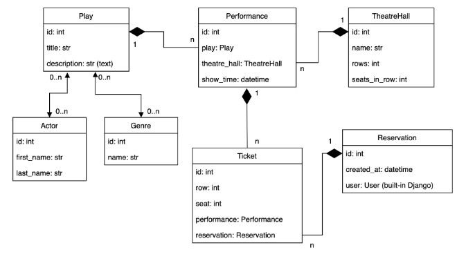

# Theatre-Service-API

Theatre Service API is a Django-based web application for theatre management.

## Features

- JWT authenticated: Secure API access with JSON Web Tokens.
- Admin panel /admin/: Access the admin panel at /admin/.
- Documentation is located at /api/doc/swagger/
- Managing reservation and tickets
- "CRUD" for all theatre objects for only admin users
- Dockerized Environment: The project is fully dockerized for easy deployment and development.
- PostgreSQL Database: Uses PostgreSQL as the database backend.


## Installation

### Prerequisites

- [Docker](https://docs.docker.com/get-started/get-docker/)
- [Docker Compose](https://docs.docker.com/compose/install/)

### Getting Started

1. Clone the repository:
```
git clone https://github.com/oleksashcherbakov/Theatre-Service-API.git
cd Theatre-Service-API
python - m venv venv
sourse venv/bin/activate
pip install - r requiments.txt
create correct .env file from .env.sample
python manage.py migrate
python manage.py runserver
```
2. Run with docker
```
docker-compose build
docker-compose up
```
3. Register a user: Access the registration endpoint at '/api/user/register'.
3. Obtain Access and Refresh Tokens: Use the endpoint at '/api/user/token' to get tokens.
4. Use Tokens: Include the tokens in the header of your HTTP requests for authentication.

#### Architecture diagram


### API Endpoints
#### User Management
- `POST /user/register/` - Register a new user
- `POST /user/token/` - Obtain JWT token
- `POST /user/token/refresh/` - Refresh JWT token
- `POST /user/token/verify/` - Verify JWT token
- `GET /user/me/` - Retrieve or update the authenticated user
#### Theatre API (prefix: /api/theatre)
- `/actors/` - List and create actors
- `/genres/` - List and create genres
- `/plays/` - List and create plays
- `/theatre_halls/` - List and create crew theatre halls
- `/performances/` - List and create performances
- `/reservations/` - List and create reservations
- `/tickets/` - List and create tickets

### Admin Interface
The Django admin interface is available at /admin/. You can use it to manage the database entries directly.

### Debug Toolbar
The Django Debug Toolbar is included in the project. It's automatically added to the URL patterns when in debug mode.
